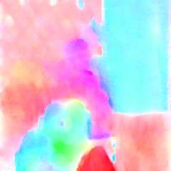
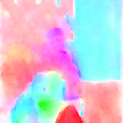

# tvnet_pytorch
This repository contains pytorch version implementation code for the project 'End-to-End Learning of Motion Representation for Video Understanding' (CVPR 2018) based on the original tensorflow implementation (http://lijiefan.me/project_webpage/TVNet_cvpr/index.html).
I also replace the original matlib code with pure python code for visualization.

## Prerequisites
#### Pytorch
We use pytorch for our implementation.

## Installation
Our current release has been tested on Ubuntu 16.04 with Python 3.6.5 and Pytorch 0.3.1.0.

#### Clone the repository
```
https://github.com/Gasoonjia/tvnet_pytorch
```

## Steps to run

#### I) Put input frames in `frame/img1.png`, `frame/img2.png`.

#### II) Use TVNet to generate motion representation 

The file (`train_options.py`) has the following options:
- `--n_m_scales`: Max number of scales in TVNet (default: 1)
- `--n_warps`: Number of warppings in TVNet (default: 1)
- `--n_iters`: Number of iterations in TVNet (default: 50)
- `--visualize`: Whether save the result into image file (default: True)
- `--demo`: Just using original weights for demo if mark it.

Sample usages include
- Generate motion representation for frames in `frame/img1.png` and `frame/img2.png`.

```
python train.py --n_m_scales 1 --n_warps 1 --n_iters 50 --demo
``` 

#### III) Check results and visualization

-TVNet generated results are saved in `result/result.mat`

-You can also find a file called `result/result.png` for visualize the flow as long as you set the flag `--visualize` in train_options.py into True.


## Sample input & output

<div align="center">
<tr>
<td></td>
<p> img1.png </p>
<td></td>
<p> img2.png </p>
<td></td>
<p> The flow generated by original tensorflow code. </p>
<td></td>
<p> The flow generated by ours without any training. </p>
<td></td>
<p> The flow generated by ours after trained 1000 iterations. </p>
</tr>
</div>

## Reference
if you find our code useful for your research, please cite their paper:

    @inproceedings{fan2018end,
    title={End-to-End Learning of Motion Representation for Video Understanding},
    author={Fan, Lijie and Huang, Wenbing and Gan, Chuang and Ermon, Stefano and Gong, Boqing and Huang, Junzhou},
    booktitle={Proceedings of the IEEE Conference on Computer Vision and Pattern Recognition (CVPR)},
    pages={},
    year={2018}
	}
